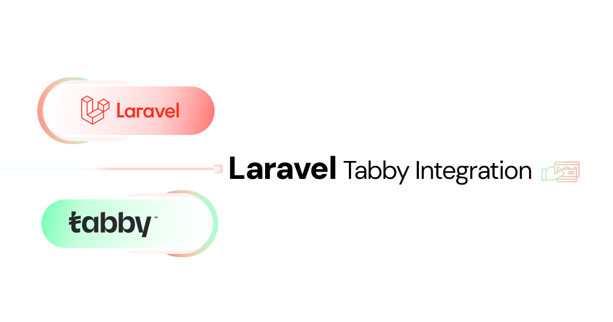

## Laravel Tabby Integration
<!-- Full-width image -->
<p align="center">
  
</p>

`laravel-tabby-integration` is a Laravel package designed to simplify the integration of the Tabby API into your Laravel applications. It provides an easy-to-use interface for creating checkout sessions, handling payments, managing webhooks, and more.

## Features

- Create, retrieve, update, and capture payments
- Register, retrieve, update, and remove webhooks
- Integrated logging for API requests and responses
- Simple and intuitive interface


## Installation

To install the package, use Composer:

```bash
composer require osa-eg/laravel-tabby-integration
```

## Configuration

Publish the configuration file:

```bash
php artisan vendor:publish --provider="Osama\TabbyIntegration\Providers\TabbyServiceProvider"
```

In your `.env` file, add the following configurations:

```env
TABBY_PUBLIC_KEY=your_public_key
TABBY_SECRET_KEY=your_secret_key
TABBY_MERCHANT_CODE=your_merchant_code
```

## Usage

### Create a Checkout Session

Create a new checkout session with the given data.

```php
use Osama\TabbyIntegration\Facades\Tabby;

$data = [
    // your checkout session data
];

$response = Tabby::createCheckoutSession($data);
```

Reference: [Post Checkout Session](https://api-docs.tabby.ai/#operation/postCheckoutSession)

### Retrieve a Payment

Retrieve a payment by its ID.

```php
$paymentId = 'your_payment_id';
$response = Tabby::getPayment($paymentId);
```

Reference: [Get Payment](https://api-docs.tabby.ai/#operation/getPayment)

### Update a Payment

Update a payment by its ID with new data.

```php
$paymentId = 'your_payment_id';
$data = [
    // your update data
];

$response = Tabby::updatePayment($paymentId, $data);
```

Reference: [Update Payment](https://api-docs.tabby.ai/#operation/putPayment)

### Capture a Payment

Capture a payment by its ID.

```php
$paymentId = 'your_payment_id';
$data = [
    // your capture data
];

$response = Tabby::capturePayment($paymentId, $data);
```

Reference: [Capture Payment](https://api-docs.tabby.ai/#operation/postPaymentCapture)

### Refund a Payment

Refund a payment by its ID.

```php
$paymentId = 'your_payment_id';
$data = [
    // your refund data
];

$response = Tabby::refundPayment($paymentId, $data);
```

Reference: [Refund Payment](https://api-docs.tabby.ai/#operation/postPaymentRefund)

### List Payments

Retrieve a list of payments with optional parameters.

```php
$params = [
    // your query parameters
];

$response = Tabby::listPayments($params);
```

Reference: [List Payments](https://api-docs.tabby.ai/#operation/getPayments)

### Register a Webhook

Register a new webhook with the given data.

```php
$data = [
    // your webhook data
];

$response = Tabby::registerWebhook($data);
```

Reference: [Post Webhook](https://api-docs.tabby.ai/#operation/postWebhook)

### List Webhooks

Retrieve a list of webhooks.

```php
$response = Tabby::listWebhooks();
```

Reference: [Get Webhooks](https://api-docs.tabby.ai/#operation/getWebhooks)

### Retrieve a Webhook

Retrieve a specific webhook by its ID.

```php
$webhookId = 'your_webhook_id';
$response = Tabby::getWebhook($webhookId);
```

Reference: [Get Webhook](https://api-docs.tabby.ai/#operation/getWebhook)

### Update a Webhook

Update a specific webhook by its ID with new data.

```php
$webhookId = 'your_webhook_id';
$data = [
    // your update data
];

$response = Tabby::updateWebhook($webhookId, $data);
```

Reference: [Update Webhook](https://api-docs.tabby.ai/#operation/putWebhook)

### Remove a Webhook

Remove a specific webhook by its ID.

```php
$webhookId = 'your_webhook_id';
$response = Tabby::removeWebhook($webhookId);
```

Reference: [Delete Webhook](https://api-docs.tabby.ai/#operation/deleteWebhook)

## Logging

The package integrates with Laravel's logging system to provide detailed logs of API requests and responses. Ensure you have a logger configured in your Laravel application to capture these logs.

## License

This package is licensed under the MIT License. See the [LICENSE](LICENSE) file for more details.
